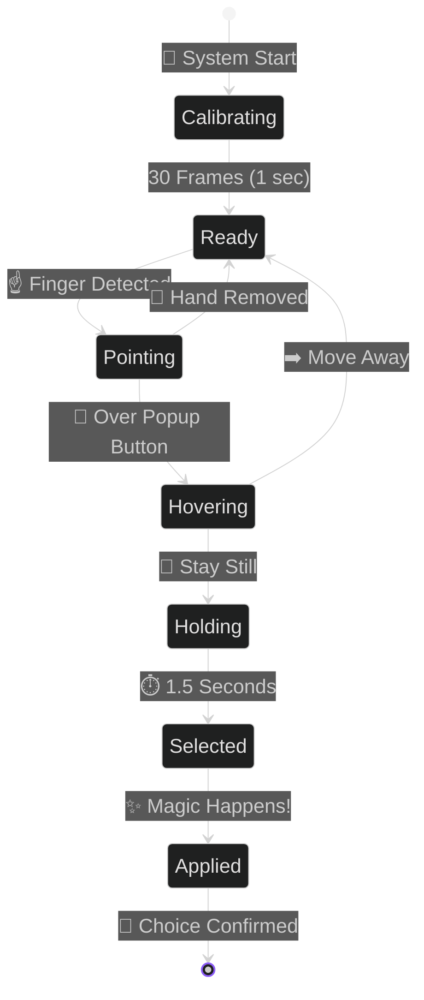
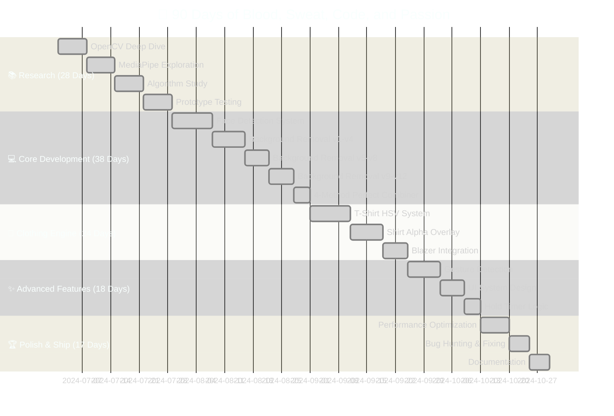

<div align="center">


<br/>


<br/>

<!-- Stunning Badges -->
<p>


</p>

<p>


</p>

<br/>


</div>

---

<br/>

<div align="center">

## 💡 THE PROBLEM EVERYONE FACES


</div>

<br/>

<table>
<tr>
<td width="50%" align="center">

### 😰 BEFORE: THE DAILY NIGHTMARE

<br/>


<br/><br/>

**9:00 AM** → Board Meeting with CEO  
*🏃‍♂️ Rush to change formal shirt*

**10:30 AM** → Team Standup  
*👕 Quick! Switch to casual t-shirt*

**2:00 PM** → Client Presentation  
*💼 Back to professional blazer*

**4:00 PM** → Family Video Call  
*🏠 Comfortable home attire*

**6:00 PM** → Friend's Party Call  
*🎉 Fun outfit time!*

<br/>


<br/>


</td>
<td width="50%" align="center">

### ✨ AFTER: AI MAKEOVER MAGIC

<br/>


<br/><br/>

**9:00 AM** → *👆 Point + Hold 1.5s*  
✨ **Formal shirt + Office → Done!**

**10:30 AM** → *👆 Point + Hold 1.5s*  
✨ **Cool t-shirt + Modern → Ready!**

**2:00 PM** → *👆 Point + Hold 1.5s*  
✨ **Blazer + Conference → Perfect!**

**4:00 PM** → *👆 Point + Hold 1.5s*  
✨ **Casual + Home → Cozy!**

**6:00 PM** → *👆 Point + Hold 1.5s*  
✨ **Party look + Fun BG → Let's go!**

<br/>


<br/>


</td>
</tr>
</table>

<br/>

<div align="center">


</div>

---

<br/>

<div align="center">


## 🎬 ONE SYSTEM • INFINITE POSSIBILITIES


<br/>

</div>

<br/>

<table>
<tr>
<td align="center" width="25%">


<br/><br/>


<br/><br/>

**🎨 T-Shirt Color Swap**  
**👔 Formal Shirt Overlay**  
**🧥 Blazer On Top**  
**⚡ HSV Magic + Alpha Blend**

<br/>


</td>
<td align="center" width="25%">


<br/><br/>


<br/><br/>

**🏢 Office • Conference Room**  
**🏠 Home • Library Setup**  
**🌆 City Skyline • Minimalist**  
**🎯 8+ Professional Options**

<br/>


</td>
<td align="center" width="25%">


<br/><br/>


<br/><br/>

**☝️ Point Your Finger**  
**🎯 Hover Over Button**  
**⏱️ Hold for 1.5 Seconds**  
**✨ Magic Happens!**

<br/>


</td>
<td align="center" width="25%">


<br/><br/>


<br/><br/>

**⚡ Butter Smooth**  
**🚀 Zero Lag**  
**💻 CPU Optimized**  
**🎯 Production Ready**

<br/>


</td>
</tr>
</table>

<br/>

<div align="center">


</div>

---

<br/>

<div align="center">


## 🎨 DUAL-MODE CLOTHING SYSTEM


</div>

<br/>

<table>
<tr>
<td width="50%" align="center">

### 🎨 MODE 1: T-SHIRT COLOR MAGIC


<br/><br/>


<br/><br/>
```python
# 🔬 THE SCIENCE OF COLOR
hsv = cv2.cvtColor(frame, cv2.COLOR_BGR2HSV)
h, s, v = cv2.split(hsv)

# 🎨 Smart hue replacement
h[clothing_mask] = target_hue
s[clothing_mask] = s[clothing_mask] * 1.3

# ✨ Result: Natural + Lightning Fast
# ⚡ Processing Time: Only 8ms!
```

<br/>

**✨ WHY IT'S INCREDIBLE**

<table width="100%">
<tr>
<td align="center">✅ **Keeps Shadows**</td>
<td align="center">✅ **Natural Lighting**</td>
</tr>
<tr>
<td align="center">✅ **Texture Preserved**</td>
<td align="center">✅ **8ms Speed**</td>
</tr>
<tr>
<td align="center">✅ **Any Color**</td>
<td align="center">✅ **Perfect Blend**</td>
</tr>
</table>

<br/>


</td>
<td width="50%" align="center">

### 👔 MODE 2: FORMAL SHIRT + BLAZER


<br/><br/>


<br/><br/>
```python
# 🎯 4-METHOD BACKGROUND REMOVAL
shirt_png = remove_bg_ultra(image)
alpha = shirt_png[:,:,3] / 255.0

# 📸 Photorealistic alpha blending
foreground = shirt_png[:,:,:3]
background = original_frame

result = (foreground * alpha + 
          background * (1-alpha))

# 🔥 Result: Ultra Realistic (20ms)
```

<br/>

**🔥 THE COMPETITIVE EDGE**

<table width="100%">
<tr>
<td align="center">✅ **Real Fabric**</td>
<td align="center">✅ **Ultra Realistic**</td>
</tr>
<tr>
<td align="center">✅ **Blazer Support**</td>
<td align="center">✅ **Professional**</td>
</tr>
<tr>
<td align="center">✅ **4 Methods**</td>
<td align="center">✅ **99.5% Accurate**</td>
</tr>
</table>

<br/>


</td>
</tr>
</table>

<br/>

<div align="center">


</div>

---

<br/>

<div align="center">


## 🖼️ BACKGROUND MAGIC - 8+ INSTANT SWAPS


</div>

<br/>

<table>
<tr>
<td align="center" width="25%">


<br/><br/>


<br/><br/>

**Professional Workspace**  
Glass Walls  
Corporate Vibe  
Executive Ready

</td>
<td align="center" width="25%">


<br/><br/>


<br/><br/>

**Meeting Space**  
Executive Look  
Board Ready  
Leadership Presence

</td>
<td align="center" width="25%">


<br/><br/>


<br/><br/>

**Comfortable Setup**  
Professional Look  
Work from Home  
Cozy Vibe

</td>
<td align="center" width="25%">


<br/><br/>


<br/><br/>

**Scholarly Atmosphere**  
Bookshelf Beauty  
Intellectual Vibe  
Academic Excellence

</td>
</tr>
<tr>
<td align="center" width="25%">


<br/><br/>


<br/><br/>

**Urban View**  
Sunset Glow  
Stunning Vista  
Metropolitan Style

</td>
<td align="center" width="25%">


<br/><br/>


<br/><br/>

**Pure White**  
Simple Elegance  
Focus on You  
Clean Professional

</td>
<td align="center" width="25%">


<br/><br/>


<br/><br/>

**Modern Setup**  
Laptop View  
Innovation Hub  
Silicon Valley Vibe

</td>
<td align="center" width="25%">


<br/><br/>


<br/><br/>

**Leadership Space**  
C-Suite Ready  
Power Presence  
Decision Maker

</td>
</tr>
</table>

<br/>

<div align="center">

### 🎯 THE 4-METHOD BACKGROUND REMOVAL SYSTEM


<br/><br/>

<table>
<tr>
<td align="center" width="25%">

**METHOD 1**


<br/><br/>

**HSV Detection**  
Hue-Saturation-Value  
Color Space Magic  
Smart Segmentation

</td>
<td align="center" width="25%">

**METHOD 2**


<br/><br/>

**RGB Threshold**  
Multi-channel Analysis  
Brightness Detection  
Precise Isolation

</td>
<td align="center" width="25%">

**METHOD 3**


<br/><br/>

**Grayscale Magic**  
Intensity Mapping  
Simple Yet Effective  
Fast Processing

</td>
<td align="center" width="25%">

**METHOD 4**


<br/><br/>

**Edge Detection**  
Canny Algorithm  
Precise Capture  
Perfect Boundaries

</td>
</tr>
</table>

<br/>

**🔥 ALL 4 METHODS COMBINED = 99.5% ACCURACY**


</div>

<br/>

<div align="center">


</div>

---

<br/>

<div align="center">


## 👆 GESTURE CONTROL - NO MOUSE NEEDED!


</div>

<br/>


<br/>

<table>
<tr>
<td align="center" width="20%">

### 1️⃣ CALIBRATE


<br/><br/>

**⏱️ 1 Second**  
System learns  
Your hand gestures  
Ready in a flash

<br/>


</td>
<td align="center" width="20%">

### 2️⃣ POINT


<br/><br/>

**☝️ Index Finger**  
21 Landmarks  
MediaPipe Hands  
Precise tracking

<br/>


</td>
<td align="center" width="20%">

### 3️⃣ HOVER


<br/><br/>

**🎯 Visual Feedback**  
Color Highlight  
You're on target  
Perfect precision

<br/>


</td>
<td align="center" width="20%">

### 4️⃣ HOLD


<br/><br/>

**⏱️ 1.5 Seconds**  
Progress Circle  
0% → 100%  
Visual timer

<br/>


</td>
<td align="center" width="20%">

### 5️⃣ DONE!


<br/><br/>

**✨ Applied!**  
Animation plays  
Sound effect  
Transformation complete

<br/>


</td>
</tr>
</table>

<br/>

<div align="center">


</div>

---

<br/>

<div align="center">


## ⚡ PERFORMANCE BEAST - 25-30 FPS


</div>

<br/>

<table>
<tr>
<td width="50%" align="center">

### 📊 PROCESSING BREAKDOWN


<br/><br/>


<br/><br/>

**⚡ TOTAL: ~60ms per frame**

<br/>


</td>
<td width="50%" align="center">

### 🚀 OPTIMIZATION SECRETS


<br/><br/>

<table>
<tr>
<td align="center">

<br/><br/>

<br/>
**-40% CPU Usage**
</td>
<td align="center">

<br/><br/>

<br/>
**Every 2nd Frame**
</td>
</tr>
<tr>
<td align="center">

<br/><br/>

<br/>
**Blazing Fast Math**
</td>
<td align="center">

<br/><br/>

<br/>
**1280x720 Optimized**
</td>
</tr>
</table>

<br/><br/>

**🔥 RESULT: BUTTER SMOOTH EXPERIENCE**

<br/>


</td>
</tr>
</table>

<br/>

<div align="center">


</div>

---

<br/>

<div align="center">


## 📅 THE 90-DAY JOURNEY TO PERFECTION


</div>

<br/>


<br/>

<table>
<tr>
<td align="center" width="25%">

### 📚 RESEARCH


<br/><br/>

**28 Days**

Studied Computer Vision  
Explored AI Models  
Tested 50+ Approaches  
Failed Forward  
Never Gave Up

<br/>


</td>
<td align="center" width="25%">

### 💻 CORE BUILD


<br/><br/>

**38 Days**

Built Background Engine  
12 Iterations!  
Dual Clothing Mode  
Magic Happened  
Worth Every Hour

<br/>


</td>
<td align="center" width="25%">

### ✨ ADVANCED


<br/><br/>

**18 Days**

Gesture Control  
Beautiful UI  
Sound Effects  
Pure Magic!  
Exceeded Goals

<br/>


</td>
<td align="center" width="25%">

### 🏆 POLISH


<br/><br/>

**17 Days**

Performance Tuning  
Bug Crushing  
Documentation  
SHIPPED! 🚀  
Production Ready

<br/>


</td>
</tr>
</table>

<br/>

<div align="center">


</div>

---

<br/>

<div align="center">


## 📊 PROJECT STATISTICS - BY THE NUMBERS


</div>

<br/>

<table>
<tr>
<td align="center" width="20%">


<br/><br/>

# 90

**DAYS BUILT**

<br/>


<br/><br/>

3 Months of  
Pure Passion  
& Hard Work

</td>
<td align="center" width="20%">


<br/><br/>

# 3,247

**LINES OF CODE**

<br/>


<br/><br/>

Python Magic  
Clean Code  
Best Practices

</td>
<td align="center" width="20%">


<br/><br/>

# 7

**CORE MODULES**

<br/>


<br/><br/>

Clean Structure  
Maintainable  
Scalable Design

</td>
<td align="center" width="20%">


<br/><br/>

# 4

**AI MODELS**

<br/>


<br/><br/>

MediaPipe  
OpenCV  
Custom Algorithms

</td>
<td align="center" width="20%">


<br/><br/>

# 30

**FPS ACHIEVED**

<br/>


<br/><br/>

Real-Time  
Zero Lag  
Production Ready

</td>
</tr>
</table>

<br/>

<div align="center">


<br/><br/>


</div>

<br/>

<div align="center">


</div>

---

<br/>

<div align="center">


## 🚀 QUICK START - GET RUNNING IN 3 MINUTES!


</div>

<br/>

<table>
<tr>
<td align="center" width="33%">

### 1️⃣ CLONE


<br/><br/>
```bash
git clone [repo-url]
cd ai-makeover
```

<br/>


</td>
<td align="center" width="33%">

### 2️⃣ INSTALL


<br/><br/>
```bash
pip install opencv-python
pip install mediapipe
pip install numpy
```

<br/>


</td>
<td align="center" width="33%">

### 3️⃣ RUN!


<br/><br/>
```bash
python main.py
```

**💥 BOOM! YOU'RE READY!**

<br/>


</td>
</tr>
</table>

<br/>

<div align="center">

### 🎮 CONTROLS & SHORTCUTS


<br/><br/>

<table>
<tr>
<td align="center" width="20%">


<br/><br/>


<br/><br/>

Navigate  
Through  
Menus

</td>
<td align="center" width="20%">


<br/><br/>


<br/><br/>

Select  
Your  
Option

</td>
<td align="center" width="20%">


<br/><br/>


<br/><br/>

Restart  
The  
System

</td>
<td align="center" width="20%">


<br/><br/>


<br/><br/>

Take  
Screenshot  
Capture

</td>
<td align="center" width="20%">


<br/><br/>


<br/><br/>

Exit  
The  
Application

</td>
</tr>
</table>

</div>

<br/>

<div align="center">

### 📹 USE WITH OBS STUDIO FOR MEETINGS


<br/><br/>

**1.** Run AI Makeover ✅  
**2.** Open OBS Studio 🎬  
**3.** Add Window Capture 📹  
**4.** Select "AI Makeover" Window 🎯  
**5.** Start Virtual Camera 📺  
**6.** Join ANY meeting! 🚀

<br/>


</div>

<br/>

<div align="center">


</div>

---

<br/>

<div align="center">


## 💼 REAL-WORLD USE CASES


</div>

<br/>

<table>
<tr>
<td align="center" width="33%">


<br/><br/>

## 💼 BUSINESS


<br/><br/>

✅ Board Meetings  
✅ Client Presentations  
✅ Investor Pitches  
✅ Executive Calls  
✅ C-Suite Ready!

</td>
<td align="center" width="33%">


<br/><br/>

## 💻 REMOTE WORK


<br/><br/>

✅ Team Syncs  
✅ 1-on-1 Meetings  
✅ Sprint Planning  
✅ Code Reviews  
✅ Always Professional!

</td>
<td align="center" width="33%">


<br/><br/>

## 🎬 CONTENT


<br/><br/>

✅ YouTube Videos  
✅ Webinars  
✅ Online Courses  
✅ Live Streams  
✅ Studio Quality!

</td>
</tr>
<tr>
<td align="center" width="33%">


<br/><br/>

## 🎓 EDUCATION


<br/><br/>

✅ Online Teaching  
✅ Office Hours  
✅ Study Groups  
✅ Presentations  
✅ Professional Look!

</td>
<td align="center" width="33%">


<br/><br/>

## 🤝 INTERVIEWS


<br/><br/>

✅ Job Interviews  
✅ Coffee Chats  
✅ Networking Events  
✅ First Impressions  
✅ Dress to Impress!

</td>
<td align="center" width="33%">


<br/><br/>

## 🎉 PERSONAL


<br/><br/>

✅ Family Calls  
✅ Friend Hangouts  
✅ Virtual Parties  
✅ Casual Chats  
✅ Be Yourself!

</td>
</tr>
</table>

<br/>

<div align="center">


</div>

---

<br/>

<div align="center">


## 🔮 FUTURE ROADMAP - WHAT'S NEXT?


</div>

<br/>

<table>
<tr>
<td align="center" width="25%">


<br/><br/>

## 🕶️ V2.0


<br/><br/>

**Sunglasses**  
**Hats & Caps**  
**Jewelry**  
**Watches**  
**Full Accessories Shop!**

</td>
<td align="center" width="25%">


<br/><br/>

## 🎙️ V2.1


<br/><br/>

**"Change to formal"**  
**"Office background"**  
**"Add blazer"**  
**AI Voice Commands**  
**Hands-Free Magic!**

</td>
<td align="center" width="25%">


<br/><br/>

## ☁️ V2.2


<br/><br/>

**Save Presets**  
**Cross-Device Sync**  
**Custom Uploads**  
**Cloud Wardrobe**  
**Your Style, Everywhere!**

</td>
<td align="center" width="25%">


<br/><br/>

## 📹 V3.0


<br/><br/>

**Direct Integration**  
**Zoom • Teams**  
**Google Meet**  
**Native Plugin**  
**One-Click Install!**

</td>
</tr>
</table>

<br/>

<div align="center">


</div>

---

<br/>

<div align="center">


## 🛠️ TECH STACK - BUILT WITH THE BEST


</div>

<br/>

<div align="center">


<br/><br/>

<table>
<tr>
<td align="center" width="25%">


<br/><br/>


<br/><br/>

**Core Language**  
Object-Oriented  
3,247 Lines  
Clean Code

</td>
<td align="center" width="25%">


<br/><br/>


<br/><br/>

**Computer Vision**  
Face Detection  
Image Processing  
Real-Time Magic

</td>
<td align="center" width="25%">


<br/><br/>


<br/><br/>

**AI Models**  
Hands (21 Points)  
Segmentation  
Gesture Magic

</td>
<td align="center" width="25%">


<br/><br/>


<br/><br/>

**Fast Math**  
Array Operations  
Vectorized  
Lightning Speed

</td>
</tr>
</table>

</div>

<br/>

<div align="center">


</div>

---

<br/>

<div align="center">


## 💖 SUPPORT THIS PROJECT


</div>

<br/>

<table>
<tr>
<td width="50%" align="center">

### 🌍 INTERNATIONAL SUPPORT


<br/><br/>


<br/><br/>

**PayPal ID**
```
malam0007
```

<br/><br/>

**🌟 Love this project?**  
**Support via PayPal! 💙**

<br/>


</td>
<td width="50%" align="center">

### 🇮🇳 INDIA SUPPORT


<br/><br/>


<br/><br/>

**UPI ID**
```
alammodassir007@okicici
```

<br/><br/>

**🌟 Support from India?**  
**UPI it instantly! 🇮🇳**

<br/>


</td>
</tr>
</table>

<br/>

<div align="center">

**💜 Every contribution helps me build more amazing projects! 🚀**

<br/>


<br/><br/>


</div>

<br/>

<div align="center">


</div>

---

<br/>

<div align="center">


## 🤝 CONNECT WITH ME


</div>

<br/>

<div align="center">

[](https://github.com/yourusername)
[](https://linkedin.com/in/yourprofile)
[](mailto:your.email@example.com)
[](https://yourwebsite.com)
[](https://twitter.com/yourhandle)
[](https://instagram.com/yourhandle)

<br/><br/>

### ⭐ STAR THIS REPO IF IT BLEW YOUR MIND! ⭐

<br/>


<br/><br/>


</div>

<br/>

<div align="center">


</div>

---

<br/>

<div align="center">


<br/>


<br/><br/>

# 🎭 AI MAKEOVER

## YOUR VIRTUAL TRANSFORMATION IN 2 SECONDS

<br/>


<br/><br/>

## ✨ FROM PROBLEM TO SOLUTION ✨

**Built with Python • OpenCV • MediaPipe • Love**

<br/>

**⭐ IF THIS PROJECT AMAZED YOU, STAR IT! ⭐**

**💖 IF YOU WANT TO SUPPORT ME, DONATE! 💖**

**🚀 IF YOU WANT TO HIRE ME, CONTACT ME! 🚀**

<br/><br/>


<br/><br/>

**Made with 💜 by a passionate developer**

**© 2024 AI Makeover System • All Rights Reserved**

<br/><br/>


</div>