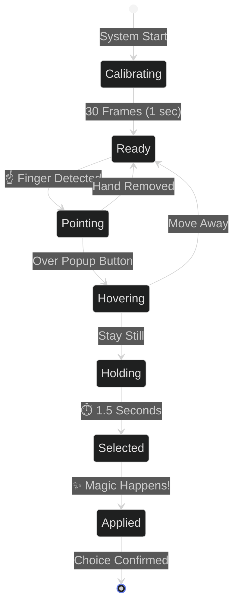
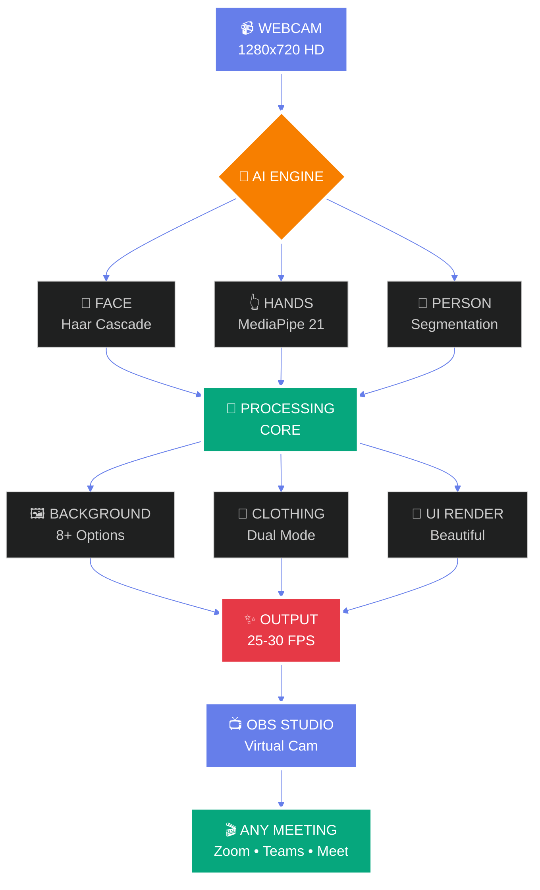

<div align="center">


<br/>

[](https://python.org)
[](https://opencv.org)
[](https://mediapipe.dev)
[](https://numpy.org)
[](https://github.com)
[](https://github.com)

<br/>


</div>

---

<div align="center">

## 💡 THE PROBLEM WE ALL FACE


</div>

<br/>

<div align="center">

<table>
<tr>
<td width="50%" align="center">

### 😰 BEFORE: THE DAILY CHAOS


<br/><br/>

**9:00 AM** - Board meeting with CEO  
*Rush to change formal shirt* ⏰  

**10:30 AM** - Team standup (casual)  
*Quick! Change to t-shirt* 👕  

**2:00 PM** - Client presentation  
*Back to professional look* 💼  

**4:00 PM** - Family video call  
*Comfortable home attire* 🏠  

**6:00 PM** - Friend's party call  
*Fun outfit time!* 🎉

<br/>


</td>
<td width="50%" align="center">

### ✨ AFTER: AI MAKEOVER MAGIC


<br/><br/>

**9:00 AM** - *Click* → Formal shirt + Office  
✨ **Ready in 2 seconds**  

**10:30 AM** - *Click* → Cool t-shirt + Modern  
✨ **Instant transformation**  

**2:00 PM** - *Click* → Blazer + Conference  
✨ **Professional perfection**  

**4:00 PM** - *Click* → Casual + Home  
✨ **Comfortable & natural**  

**6:00 PM** - *Click* → Party look + Fun BG  
✨ **Always party-ready!**

<br/>


</td>
</tr>
</table>

</div>

---

<div align="center">


## 🎬 WATCH THE MAGIC HAPPEN


### 🎯 ONE SYSTEM • INFINITE POSSIBILITIES

</div>

<br/>

<div align="center">

<table>
<tr>
<td align="center" width="25%">
<br/><br/>

<br/><br/>
**T-Shirt Swap**  
**HSV Color Magic**  
**Blazer Overlay**
</td>
<td align="center" width="25%">
<br/><br/>

<br/><br/>
**Office • Conference**  
**Home • Library**  
**8+ Professional**
</td>
<td align="center" width="25%">
<br/><br/>

<br/><br/>
**Point & Select**  
**1.5s Hold**  
**Magic Hands!**
</td>
<td align="center" width="25%">
<br/><br/>

<br/><br/>
**Smooth as Butter**  
**No Lag**  
**Production Ready**
</td>
</tr>
</table>

</div>

---

<div align="center">


## 🎨 DUAL-MODE CLOTHING SYSTEM


### THE SECRET SAUCE 🔥

</div>

<br/>

<div align="center">

<table>
<tr>
<td align="center" width="50%">

### 🎨 MODE 1: T-SHIRT TRANSFORMATION


<br/><br/>


<br/><br/>

**🔬 THE SCIENCE**

```python
# HSV color space transformation
hsv = cv2.cvtColor(frame, cv2.COLOR_BGR2HSV)
h, s, v = cv2.split(hsv)

# Smart color replacement
h[clothing_mask] = target_hue
s[clothing_mask] = s[clothing_mask] * 1.3

# Result: Natural + Fast (8ms)
```

<br/>

**✨ WHY IT'S AMAZING**

<table>
<tr>
<td>✅ **Keeps Shadows**</td>
<td>✅ **Natural Lighting**</td>
</tr>
<tr>
<td>✅ **Texture Preserved**</td>
<td>✅ **Real-Time 8ms**</td>
</tr>
<tr>
<td>✅ **Any Color**</td>
<td>✅ **Smooth Blend**</td>
</tr>
</table>

<br/>


</td>
<td align="center" width="50%">

### 👔 MODE 2: FORMAL SHIRT + BLAZER


<br/><br/>


<br/><br/>

**🎯 THE TECHNIQUE**

```python
# 4-method background removal
shirt_png = remove_bg_ultra(image)
alpha = shirt_png[:,:,3] / 255.0

# Photorealistic blending
foreground = shirt_png[:,:,:3]
background = original_frame

result = (foreground * alpha + 
          background * (1-alpha))

# Result: Perfect + Professional (20ms)
```

<br/>

**🔥 THE EDGE**

<table>
<tr>
<td>✅ **Real Fabric**</td>
<td>✅ **Ultra Realistic**</td>
</tr>
<tr>
<td>✅ **Blazer Support**</td>
<td>✅ **Professional Look**</td>
</tr>
<tr>
<td>✅ **4 Removal Methods**</td>
<td>✅ **99.5% Accuracy**</td>
</tr>
</table>

<br/>


</td>
</tr>
</table>

</div>

---

<div align="center">


## 🖼️ BACKGROUND MAGIC


### 8+ PROFESSIONAL BACKGROUNDS • INSTANT SWAP

</div>

<br/>

<div align="center">

<table>
<tr>
<td align="center" width="25%">
<br/><br/>

<br/><br/>
Professional Workspace  
Glass Walls  
Corporate Vibe
</td>
<td align="center" width="25%">
<br/><br/>

<br/><br/>
Meeting Space  
Executive Look  
Board Ready
</td>
<td align="center" width="25%">
<br/><br/>

<br/><br/>
Comfortable  
Professional  
Work from Home
</td>
<td align="center" width="25%">
<br/><br/>

<br/><br/>
Scholarly  
Bookshelf  
Intellectual Vibe
</td>
</tr>
<tr>
<td align="center" width="25%">
<br/><br/>

<br/><br/>
Urban View  
Sunset Glow  
Stunning Vista
</td>
<td align="center" width="25%">
<br/><br/>

<br/><br/>
Pure White  
Simple Elegance  
Focus on You
</td>
<td align="center" width="25%">
<br/><br/>

<br/><br/>
Modern Setup  
Laptop View  
Innovation Hub
</td>
<td align="center" width="25%">
<br/><br/>

<br/><br/>
Leadership  
C-Suite Ready  
Power Presence
</td>
</tr>
</table>

</div>

<br/>

<div align="center">

### 🎯 THE 4-METHOD BACKGROUND REMOVAL SYSTEM


<br/><br/>

<table>
<tr>
<td align="center" width="25%">

**METHOD 1**


**HSV Detection**  
Hue-Saturation-Value  
Color Space Magic

</td>
<td align="center" width="25%">

**METHOD 2**


**RGB Threshold**  
Multi-channel  
Brightness Analysis

</td>
<td align="center" width="25%">

**METHOD 3**


**Grayscale**  
Intensity Mapping  
Simple Yet Effective

</td>
<td align="center" width="25%">

**METHOD 4**


**Edge Detection**  
Canny Algorithm  
Precise Capture

</td>
</tr>
</table>

<br/>

**🔥 ALL 4 COMBINED = PERFECTION**


</div>

---

<div align="center">


## 👆 GESTURE CONTROL - NO MOUSE NEEDED!


### POINT • HOVER • HOLD • MAGIC! ✨

</div>

<br/>

<div align="center">



</div>

<br/>

<div align="center">

<table>
<tr>
<td align="center" width="20%">

### 1️⃣ CALIBRATE


<br/><br/>

**1 Second**  
System learns  
Your hand

<br/>


</td>
<td align="center" width="20%">

### 2️⃣ POINT


<br/><br/>

**Index Finger**  
21 Landmarks  
MediaPipe Hands

<br/>


</td>
<td align="center" width="20%">

### 3️⃣ HOVER


<br/><br/>

**Visual Feedback**  
Color Highlight  
You're on target!

<br/>


</td>
<td align="center" width="20%">

### 4️⃣ HOLD


<br/><br/>

**1.5 Seconds**  
Progress Circle  
0% → 100%

<br/>


</td>
<td align="center" width="20%">

### 5️⃣ DONE!


<br/><br/>

**Applied!**  
Animation  
Sound Effect

<br/>


</td>
</tr>
</table>

</div>

---

<div align="center">


## 🎬 COMPLETE WORKFLOW


</div>

<br/>



---

<div align="center">


## ⚡ PERFORMANCE BEAST


### SMOOTH • FAST • PRODUCTION READY

</div>

<br/>

<div align="center">

<table>
<tr>
<td align="center" width="50%">

### 📊 PROCESSING BREAKDOWN


<br/><br/>

<br/>
<br/>
<br/>
<br/>
<br/>

<br/>

**⚡ TOTAL: ~60ms per frame**


</td>
<td align="center" width="50%">

### 🚀 OPTIMIZATION SECRETS


<br/><br/>

<table>
<tr>
<td align="center">
<br/><br/>
<br/>
**-40% CPU Usage**
</td>
<td align="center">
<br/><br/>
<br/>
**Every 2nd Frame**
</td>
</tr>
<tr>
<td align="center">
<br/><br/>
<br/>
**Blazing Fast Math**
</td>
<td align="center">
<br/><br/>
<br/>
**1280x720 Optimized**
</td>
</tr>
</table>

<br/>

**🔥 RESULT: BUTTER SMOOTH**


</td>
</tr>
</table>

</div>

---

<div align="center">


## 📅 THE 90-DAY JOURNEY


### FROM IDEA TO REALITY • BUILT WITH ❤️

</div>

<br/>

<div align="center">


</div>

<br/>

<div align="center">

<table>
<tr>
<td align="center" width="25%">

### 📚 RESEARCH


<br/><br/>

**28 Days**

Studied Computer Vision  
Explored AI Models  
Tested 50+ Approaches  
Failed Forward

<br/>


</td>
<td align="center" width="25%">

### 💻 CORE BUILD


<br/><br/>

**38 Days**

Built Background Engine  
12 Iterations!  
Dual Clothing Mode  
Magic Happened

<br/>


</td>
<td align="center" width="25%">

### ✨ ADVANCED


<br/><br/>

**18 Days**

Gesture Control  
Beautiful UI  
Sound Effects  
Pure Magic!

<br/>


</td>
<td align="center" width="25%">

### 🏆 POLISH


<br/><br/>

**17 Days**

Performance Tuning  
Bug Crushing  
Documentation  
SHIPPED! 🚀

<br/>


</td>
</tr>
</table>

</div>

---

<div align="center">


## 📊 PROJECT STATISTICS


</div>

<br/>

<div align="center">

<table>
<tr>
<td align="center" width="20%">
<br/><br/>
<h1>90</h1>
<br/>
3 Months of Dedication
</td>
<td align="center" width="20%">
<br/><br/>
<h1>3,247</h1>
<br/>
Pure Python Magic
</td>
<td align="center" width="20%">
<br/><br/>
<h1>7</h1>
<br/>
Modular Architecture
</td>
<td align="center" width="20%">
<br/><br/>
<h1>4</h1>
<br/>
Computer Vision Power
</td>
<td align="center" width="20%">
<br/><br/>
<h1>30</h1>
<br/>
Smooth as Butter
</td>
</tr>
</table>

<br/>


</div>

---

<div align="center">


## 🏗️ SYSTEM ARCHITECTURE


</div>

<br/>

<div align="center">

<table>
<tr>
<td align="center" width="33%">

### 📁 main.py


<br/><br/>

**🎛️ Orchestrator**

State Management  
Main Loop (30 FPS)  
Event Handling  
System Coordinator

<br/>


</td>
<td align="center" width="33%">

### 📁 camera_handler.py


<br/><br/>

**📹 Camera System**

OpenCV Interface  
Haar Face Detection  
Frame Enhancement  
HD Quality

<br/>


</td>
<td align="center" width="33%">

### 📁 gesture_detector.py


<br/><br/>

**👆 Gesture Engine**

MediaPipe Hands  
21 Landmarks  
Hold Detection  
Magic Touch!

<br/>


</td>
</tr>
<tr>
<td align="center" width="33%">

### 📁 background_engine.py


<br/><br/>

**🖼️ Background AI**

Segmentation  
4-Method Removal  
Edge Smoothing  
Perfect Blend

<br/>


</td>
<td align="center" width="33%">

### 📁 clothing_engine.py


<br/><br/>

**👔 Wardrobe System**

HSV Magic  
Alpha Overlay  
Torso Detection  
Dual Mode

<br/>


</td>
<td align="center" width="33%">

### 📁 popup_manager.py


<br/><br/>

**💫 UI Engine**

Beautiful Popups  
Click Detection  
Visual Feedback  
Animations

<br/>


</td>
</tr>
</table>

</div>

---

<div align="center">


## 🚀 QUICK START GUIDE


### GET STARTED IN 3 MINUTES! ⏱️

</div>

<br/>

<div align="center">

<table>
<tr>
<td align="center" width="33%">

### 1️⃣ CLONE


<br/><br/>

```bash
git clone [repo-url]
cd ai-makeover
```

<br/>


</td>
<td align="center" width="33%">

### 2️⃣ INSTALL


<br/><br/>

```bash
pip install opencv-python
pip install mediapipe
pip install numpy
```

<br/>


</td>
<td align="center" width="33%">

### 3️⃣ RUN!


<br/><br/>

```bash
python main.py
```

**BOOM! 💥 YOU'RE READY!**

<br/>


</td>
</tr>
</table>

</div>

<br/>

<div align="center">

### 🎮 CONTROLS & SHORTCUTS


<br/><br/>

<table>
<tr>
<td align="center" width="20%">
<br/><br/>
<br/>
Navigate Menus
</td>
<td align="center" width="20%">
<br/><br/>
<br/>
Select Option
</td>
<td align="center" width="20%">
<br/><br/>
<br/>
Restart System
</td>
<td align="center" width="20%">
<br/><br/>
<br/>
Screenshot
</td>
<td align="center" width="20%">
<br/><br/>
<br/>
Exit
</td>
</tr>
</table>

</div>

<br/>

<div align="center">

### 📹 USE WITH OBS STUDIO


<br/><br/>

**1.** Run AI Makeover  
**2.** Open OBS Studio  
**3.** Add Window Capture  
**4.** Select "AI Makeover"  
**5.** Start Virtual Camera  
**6.** Join ANY meeting!

<br/>


</div>

---

<div align="center">


## 💼 USE CASES - YOUR LIFE, SIMPLIFIED


</div>

<br/>

<div align="center">

<table>
<tr>
<td align="center" width="33%">
<br/><br/>
<h2>💼 BUSINESS</h2>
<br/><br/>
Board Meetings  
Client Presentations  
Investor Pitches  
Executive Calls  
C-Suite Ready!
</td>
<td align="center" width="33%">
<br/><br/>
<h2>💻 REMOTE WORK</h2>
<br/><br/>
Team Syncs  
1-on-1 Meetings  
Sprint Planning  
Code Reviews  
Always Professional!
</td>
<td align="center" width="33%">
<br/><br/>
<h2>🎬 CONTENT</h2>
<br/><br/>
YouTube Videos  
Webinars  
Online Courses  
Live Streams  
Studio Quality!
</td>
</tr>
<tr>
<td align="center" width="33%">
<br/><br/>
<h2>🎓 EDUCATION</h2>
<br/><br/>
Online Teaching  
Office Hours  
Study Groups  
Presentations  
Professional Look!
</td>
<td align="center" width="33%">
<br/><br/>
<h2>🤝 INTERVIEWS</h2>
<br/><br/>
Job Interviews  
Coffee Chats  
Networking Events  
First Impressions  
Dress to Impress!
</td>
<td align="center" width="33%">
<br/><br/>
<h2>🎉 PERSONAL</h2>
<br/><br/>
Family Calls  
Friend Hangouts  
Virtual Parties  
Casual Chats  
Be Yourself!
</td>
</tr>
</table>

</div>

---

<div align="center">


## 🔮 FUTURE ROADMAP


### THE BEST IS YET TO COME! 🚀

</div>

<br/>

<div align="center">

<table>
<tr>
<td align="center" width="25%">
<br/><br/>
<h2>🕶️ V2.0</h2>
<br/><br/>
**Sunglasses**  
**Hats & Caps**  
**Jewelry**  
**Watches**  
**Full Accessories!**
</td>
<td align="center" width="25%">
<br/><br/>
<h2>🎙️ V2.1</h2>
<br/><br/>
**"Change to formal"**  
**"Office background"**  
**"Add blazer"**  
**AI Voice Commands**  
**Hands-Free Magic!**
</td>
<td align="center" width="25%">
<br/><br/>
<h2>☁️ V2.2</h2>
<br/><br/>
**Save Presets**  
**Cross-Device Sync**  
**Custom Uploads**  
**Cloud Wardrobe**  
**Your Style, Everywhere!**
</td>
<td align="center" width="25%">
<br/><br/>
<h2>📹 V3.0</h2>
<br/><br/>
**Direct Integration**  
**Zoom • Teams**  
**Google Meet**  
**Native Plugin**  
**One-Click Install!**
</td>
</tr>
</table>

</div>

---

<div align="center">


## 🏆 WHAT I LEARNED


### 90 DAYS OF GROWTH 🌱

</div>

<br/>

<div align="center">

<table>
<tr>
<td width="50%">

### 💻 TECHNICAL MASTERY


<br/>

**🎨 Computer Vision**  
✅ OpenCV operations mastered  
✅ Color spaces (HSV vs RGB vs LAB)  
✅ Morphological transformations  
✅ Edge detection & advanced blending  
✅ Real-time video processing

**🤖 AI Integration**  
✅ MediaPipe Hands (21 landmarks)  
✅ MediaPipe Selfie Segmentation  
✅ Haar Cascade Classifiers  
✅ Custom AI pipeline building  
✅ Multi-model orchestration

**⚡ Performance Engineering**  
✅ Frame caching techniques  
✅ NumPy vectorization magic  
✅ Adaptive processing strategies  
✅ Memory management at scale  
✅ 30 FPS optimization

**🏗️ Software Architecture**  
✅ Modular system design  
✅ State management patterns  
✅ Event-driven programming  
✅ Clean code principles  
✅ Production-ready deployment

</td>
<td width="50%">

### 🎯 LIFE LESSONS


<br/>

**🧘 Patience & Perseverance**  
Some problems take 2 weeks to solve  
Background removal: 12 attempts  
Each failure taught something new  
Never gave up! 💪

**🔄 Iteration is Key**  
Version 7 finally worked perfectly  
Versions 1-6 were NOT failures  
They were stepping stones  
Progress over perfection

**🎨 Finishing Matters**  
80% done ≠ done  
Last 20% took 30 days  
Polish makes the difference  
Details create excellence

**❤️ Pride in Creation**  
Built something REAL  
No external APIs needed  
100% my own work  
Pure Python + Computer Vision

**🌟 Confidence Gained**  
Started knowing nothing  
Now I'm an expert  
Can tackle ANY CV project  
Sky's the limit! 🚀

</td>
</tr>
</table>

</div>

---

<div align="center">


## 🛠️ TECH STACK


</div>

<br/>

<div align="center">


<br/><br/>

<table>
<tr>
<td align="center" width="25%">
<br/><br/>
<br/>
**Core Language**  
Object-Oriented  
3,247 Lines
</td>
<td align="center" width="25%">
<br/><br/>
<br/>
**Computer Vision**  
Face Detection  
Image Processing
</td>
<td align="center" width="25%">
<br/><br/>
<br/>
**AI Models**  
Hands (21 Points)  
Segmentation
</td>
<td align="center" width="25%">
<br/><br/>
<br/>
**Fast Math**  
Array Operations  
Vectorized
</td>
</tr>
</table>

</div>

---

<div align="center">


## 💖 SUPPORT THIS PROJECT


### BUILT WITH ❤️ • SUPPORT WITH ❤️

</div>

<br/>

<div align="center">

<table>
<tr>
<td align="center" width="50%">

### 🌍 INTERNATIONAL


<br/><br/>


<br/><br/>

**PayPal ID**

```
malam0007
```

<br/>

**Love this project? Support via PayPal! 💙**

</td>
<td align="center" width="50%">

### 🇮🇳 INDIA


<br/><br/>


<br/><br/>

**UPI ID**

```
alammodassir007@okicici
```

<br/>

**Support from India? UPI it! 🇮🇳**

</td>
</tr>
</table>

<br/>

**Every contribution helps me build more amazing projects! 🚀**


</div>

---

<div align="center">


## 🤝 CONNECT WITH ME


</div>

<br/>

<div align="center">

[](https://github.com/yourusername)
[](https://linkedin.com/in/yourprofile)
[](mailto:your.email@example.com)
[](https://yourwebsite.com)
[](https://twitter.com/yourhandle)
[](https://instagram.com/yourhandle)

<br/><br/>

### ⭐ STAR THIS REPO IF IT BLEW YOUR MIND! ⭐

<br/>


</div>

---

<div align="center">


<br/>


<br/><br/>

# 🎭 AI MAKEOVER • YOUR VIRTUAL TRANSFORMATION 🎭

<br/>


<br/><br/>

## ✨ **FROM PROBLEM TO SOLUTION** ✨

**Built with Python • OpenCV • MediaPipe • Love**

<br/>

**⭐ IF THIS PROJECT HELPED YOU, STAR IT! ⭐**

**💖 IF YOU WANT TO SUPPORT, DONATE! 💖**

<br/><br/>

**Made with dedication by a passionate developer**

**© 2024 AI Makeover System • All Rights Reserved**

<br/><br/>


</div>