<div align="center">

# 🎭


<h3>90 days. One vision. Zero wardrobe changes.</h3>

<br>


</div>

---

## 💭 The Story

<table>
<tr>
<td width="60%">

<br>

### The Problem

**Monday 9 AM** - Board meeting → Formal shirt  
**Monday 11 AM** - Team sync → Casual  
**Monday 2 PM** - Client call → Professional  

Same day. Same room. **Different expectations.**

<br>

### The Realization

> *"What if I could change my outfit and background in real-time, without changing anything physically?"*

<br>

### The Journey

**90 days** of experimentation  
**4 AI models** integrated  
**7 major rebuilds** to get it right  
**1 working solution** that actually works

</td>
<td width="40%">

```
    👔
    ⬇️
    🎯
    ⬇️
    🤖
    ⬇️
    ✨
```

<br><br>

```python
if meeting == "formal":
    wear("suit")
    background("office")
elif meeting == "casual":
    wear("tshirt")
    background("home")
    
# But why change physically?
# Let AI do it.
```

</td>
</tr>
</table>

---

## ⚡ Watch It Work

<div align="center">

### 🎬 The Transformation

<!-- Replace with your actual demo GIF -->


<sub>*Add your 15-second demo showing the complete flow*</sub>

<br><br>

### The Magic Happens Here ✨

</div>

<table>
<tr>
<td align="center" width="25%">

**👤 DETECT**


<sub>2 seconds</sub>

</td>
<td align="center" width="25%">

**🖼️ REPLACE**


<sub>Instant switch</sub>

</td>
<td align="center" width="25%">

**👔 TRANSFORM**


<sub>Real-time overlay</sub>

</td>
<td align="center" width="25%">

**👆 CONTROL**


<sub>No keyboard needed</sub>

</td>
</tr>
</table>

<div align="center">
<sub>⬆️ Replace these placeholders with your 4 actual demo GIFs (200x200px each)</sub>
</div>

---

## 🎯 How It Feels

```mermaid
%%{init: {'theme':'base', 'themeVariables': { 'primaryColor':'#667eea','primaryTextColor':'#fff','primaryBorderColor':'#7C0000','lineColor':'#667eea','secondaryColor':'#006100','tertiaryColor':'#fff'}}}%%

graph LR
    A[😰 Before] -->|Install| B[😊 After]
    
    style A fill:#ef4444,stroke:#dc2626,stroke-width:2px,color:#fff
    style B fill:#10b981,stroke:#059669,stroke-width:2px,color:#fff
```

<div align="center">



</div>

<table>
<tr>
<th width="50%">😰 Before This Project</th>
<th width="50%">😊 After This Project</th>
</tr>
<tr>
<td>

- Changing clothes between meetings
- Messy home backgrounds
- Awkward wardrobe moments
- Time wasted "getting ready"
- Zoom fatigue from setup

</td>
<td>

- Click → Different outfit
- Professional backgrounds always
- Confidence in every call
- Ready in 2 seconds
- Focus on the meeting, not appearance

</td>
</tr>
</table>

---

## 🔥 The Tech That Makes It Possible

```mermaid
%%{init: {'theme':'base', 'themeVariables': { 'primaryColor':'#667eea','primaryTextColor':'#fff','primaryBorderColor':'#7C0000','lineColor':'#F39C12','secondaryColor':'#006100','tertiaryColor':'#fff'}}}%%

flowchart TD
    A[📹 Camera Feed] --> B{AI Detection}
    B --> C[👤 Face]
    B --> D[👆 Hand]
    B --> E[🎯 Person]
    
    C --> F[Track Position]
    D --> G[Gesture Recognition]
    E --> H[Segmentation Mask]
    
    F --> I[🎨 Render Pipeline]
    G --> I
    H --> I
    
    I --> J[🖼️ Background Layer]
    I --> K[👔 Clothing Layer]
    I --> L[🎭 UI Layer]
    
    J --> M[✨ Final Output]
    K --> M
    L --> M
    
    M --> N[📺 Your Screen]
    
    style A fill:#667eea,stroke:#4338ca,stroke-width:2px,color:#fff
    style N fill:#10b981,stroke:#059669,stroke-width:2px,color:#fff
    style M fill:#f59e0b,stroke:#d97706,stroke-width:2px,color:#fff
```

<div align="center">



</div>

<br>

<div align="center">

### The Secret Sauce 🔬

</div>

<table>
<tr>
<td width="33%" align="center">

### 🤖 AI Models

**MediaPipe Hands**  
21-point finger tracking

**MediaPipe Selfie**  
Person segmentation

**Haar Cascades**  
Face detection

**Custom Algorithms**  
4-method bg removal

</td>
<td width="33%" align="center">

### ⚡ Performance

**5ms** - Face detect  
**15ms** - Background  
**20ms** - Clothing  
**10ms** - Gestures  

**60ms total** = **25-30 FPS**

Real-time processing ✅

</td>
<td width="33%" align="center">

### 🎨 Techniques

**HSV Color Space**  
T-shirt recoloring

**Alpha Blending**  
Shirt overlay

**Morphological Ops**  
Edge smoothing

**Smart Caching**  
40% less CPU

</td>
</tr>
</table>

---

## 🎨 The Dual-Mode System

<div align="center">

### Two Approaches. One Goal: Photorealism.

</div>

<table>
<tr>
<td width="50%" align="center">

### 🎨 Mode 1: HSV Magic

**For T-Shirts**


```python
# The magic formula
hsv = cv2.cvtColor(frame, BGR2HSV)
h, s, v = cv2.split(hsv)

h[mask] = target_hue
s[mask] = s[mask] * 1.3

result = cv2.cvtColor(merge(h,s,v), HSV2BGR)
```

**Why it works:**  
Changes color, keeps texture & shadows  
**Speed:** 8ms ⚡

</td>
<td width="50%" align="center">

### 👔 Mode 2: Alpha Overlay

**For Formal Shirts**


```python
# The transparency trick
shirt_png = remove_background(image)
alpha = shirt_png[:,:,3] / 255.0

result = (shirt * alpha + 
          frame * (1 - alpha))
```

**Why it works:**  
Real fabric, real details  
**Speed:** 20ms ⚡

</td>
</tr>
</table>

---

## 👆 The Gesture Interface

<div align="center">

### No Keyboard. No Mouse. Just Your Hand.

<br>


<br>

</div>

<table>
<tr>
<td width="25%" align="center">

**1️⃣ POINT**


Index finger detected  
21 hand landmarks tracked

</td>
<td width="25%" align="center">

**2️⃣ HOVER**


Cursor follows your finger  
Popup highlights

</td>
<td width="25%" align="center">

**3️⃣ HOLD**


Stay still 1.5 seconds  
Progress circle grows

</td>
<td width="25%" align="center">

**4️⃣ SELECT**


Choice confirmed  
Visual feedback

</td>
</tr>
</table>

---

## 📊 Behind The Scenes

<div align="center">

### 90 Days of Development

</div>


<br>

### The Numbers 📈

<table>
<tr>
<td align="center">

**90**  
Days

</td>
<td align="center">

**3,247**  
Lines of Code

</td>
<td align="center">

**7**  
Major Versions

</td>
<td align="center">

**4**  
AI Models

</td>
<td align="center">

**143**  
Git Commits

</td>
</tr>
</table>

</div>

---

## 🏗️ Architecture

<div align="center">

```
┏━━━━━━━━━━━━━━━━━━━━━━━━━━━━━━━━━━━━━━━━━━━━━━━━━━━━━━━━━━━━━┓
┃                        USER SEES THIS                         ┃
┃                                                               ┃
┃  ┌─────────────┐  ┌─────────────┐  ┌─────────────┐         ┃
┃  │  Popups 🎨  │  │ Cursor 👆  │  │ Progress ⭕ │         ┃
┃  └─────────────┘  └─────────────┘  └─────────────┘         ┃
┗━━━━━━━━━━━━━━━━━━━━━━━━━━━━━━━━━━━━━━━━━━━━━━━━━━━━━━━━━━━━━┛
                              ⬇️
┏━━━━━━━━━━━━━━━━━━━━━━━━━━━━━━━━━━━━━━━━━━━━━━━━━━━━━━━━━━━━━┓
┃                    GESTURE LAYER 👆                           ┃
┃                                                               ┃
┃     MediaPipe Hands → 21 Landmarks → Hold Detection          ┃
┗━━━━━━━━━━━━━━━━━━━━━━━━━━━━━━━━━━━━━━━━━━━━━━━━━━━━━━━━━━━━━┛
                              ⬇️
┏━━━━━━━━━━━━━━━━━━━━━━━━━━━━━━━━━━━━━━━━━━━━━━━━━━━━━━━━━━━━━┓
┃                    AI PROCESSING 🤖                           ┃
┃                                                               ┃
┃  ┌──────────────┐  ┌──────────────┐  ┌──────────────┐      ┃
┃  │ Face Detect  │  │ Segmentation │  │ Hand Track   │      ┃
┃  │ (Haar) 5ms   │  │ (MediaPipe)  │  │ (MediaPipe)  │      ┃
┃  └──────────────┘  │ 15ms         │  │ 10ms         │      ┃
┃                    └──────────────┘  └──────────────┘      ┃
┗━━━━━━━━━━━━━━━━━━━━━━━━━━━━━━━━━━━━━━━━━━━━━━━━━━━━━━━━━━━━━┛
                              ⬇️
┏━━━━━━━━━━━━━━━━━━━━━━━━━━━━━━━━━━━━━━━━━━━━━━━━━━━━━━━━━━━━━┓
┃                    TRANSFORMATION 🎨                          ┃
┃                                                               ┃
┃  ┌──────────────┐  ┌──────────────┐  ┌──────────────┐      ┃
┃  │ Background   │  │ Clothing     │  │ Caching      │      ┃
┃  │ Replacement  │  │ HSV/Overlay  │  │ -40% CPU     │      ┃
┃  └──────────────┘  └──────────────┘  └──────────────┘      ┃
┗━━━━━━━━━━━━━━━━━━━━━━━━━━━━━━━━━━━━━━━━━━━━━━━━━━━━━━━━━━━━━┛
                              ⬇️
┏━━━━━━━━━━━━━━━━━━━━━━━━━━━━━━━━━━━━━━━━━━━━━━━━━━━━━━━━━━━━━┓
┃                    CAMERA FEED 📹                             ┃
┃                                                               ┃
┃            OpenCV → 1280x720 → 30 FPS → Enhanced            ┃
┗━━━━━━━━━━━━━━━━━━━━━━━━━━━━━━━━━━━━━━━━━━━━━━━━━━━━━━━━━━━━━┛
```

</div>

<br>

<div align="center">

### 📂 7 Core Modules

</div>

<table>
<tr>
<td width="50%">

```python
📁 main.py
   └─ Application orchestrator
   └─ State management
   └─ Main loop (25-30 FPS)

📁 camera_handler.py
   └─ OpenCV camera interface
   └─ Face detection (Haar)
   └─ Frame enhancement

📁 gesture_detector.py
   └─ MediaPipe Hands
   └─ Finger tracking
   └─ Hold-to-select logic
```

</td>
<td width="50%">

```python
📁 background_engine.py
   └─ MediaPipe Selfie Segmentation
   └─ 4-method background removal
   └─ Edge smoothing

📁 clothing_engine.py
   └─ HSV color replacement
   └─ Alpha overlay system
   └─ Torso detection

📁 popup_manager.py
   └─ UI popups & icons
   └─ Click detection
   └─ Expanded hit areas

📁 ui_components.py
   └─ Screens & animations
   └─ Progress indicators
   └─ Visual feedback
```

</td>
</tr>
</table>

---

## 🚀 Quick Start

<div align="center">

### Get Running in 3 Minutes

</div>

```bash
# 1. Clone
git clone https://github.com/yourusername/ai-professional-makeover.git
cd ai-professional-makeover

# 2. Install
pip install opencv-python mediapipe numpy

# 3. Run
python main.py
```

<div align="center">

### 🎮 Controls

| Action | Key |
|--------|-----|
| 👆 Navigate | Point your finger |
| ⏱️ Select | Hold 1.5 seconds |
| 🔄 Restart | Press `R` |
| 📸 Screenshot | Press `C` |
| ❌ Quit | Press `Q` or `ESC` |

</div>

---

## 💡 What I Learned

<div align="center">

### 90 Days Changed Everything

</div>

<table>
<tr>
<td width="50%">

### 🧠 Technical Growth

**Week 1-4: The Foundation**
- OpenCV isn't just a library, it's a universe
- Color spaces (HSV vs RGB vs LAB) matter more than I thought
- Real-time = everything must be optimized

**Week 5-8: The Struggle**
- Background removal is HARD
- Tried 12 approaches before finding the right one
- MediaPipe saved my life

**Week 9-12: The Breakthrough**
- Dual-mode clothing system (HSV + Alpha)
- Frame caching = 40% performance boost
- Gesture control feels like magic

</td>
<td width="50%">

### 🎯 Life Lessons

**Patience**
- Some problems take 2 weeks to solve
- That's okay

**Iteration**
- Version 7 finally worked
- Versions 1-6 taught me what doesn't work

**Finishing**
- 80% done ≠ done
- The last 20% took 30 days

**Pride**
- Built something that actually works
- No external APIs, no cloud dependencies
- Just pure Python + Computer Vision

</td>
</tr>
</table>

---

## 🎯 Use Cases

<div align="center">

<table>
<tr>
<td align="center" width="33%">


### Business

Board meetings  
Client presentations  
Investor pitches

</td>
<td align="center" width="33%">


### Remote Work

Daily standups  
Team syncs  
1-on-1s

</td>
<td align="center" width="33%">


### Content

Webinars  
Online courses  
YouTube videos

</td>
</tr>
<tr>
<td align="center" width="33%">


### Education

Virtual classes  
Office hours  
Study groups

</td>
<td align="center" width="33%">


### Interviews

Job interviews  
Coffee chats  
Networking

</td>
<td align="center" width="33%">


### Personal

Family calls  
Friend chats  
Virtual parties

</td>
</tr>
</table>

</div>

---

## 🌟 What's Next

<div align="center">

### The Roadmap

</div>

<table>
<tr>
<td width="25%" align="center">

**v2.0**

🕶️ Accessories  
Glasses, hats, jewelry

</td>
<td width="25%" align="center">

**v2.1**

🎙️ Voice Control  
"Change to formal"

</td>
<td width="25%" align="center">

**v2.2**

☁️ Cloud Sync  
Save presets

</td>
<td width="25%" align="center">

**v3.0**

📹 Plugin  
Zoom/Teams/Meet

</td>
</tr>
</table>

---

## 💼 Why This Matters

<div align="center">

> **"This project taught me that building something real is different from following tutorials."**

<br>

### The Real Challenges

</div>

<table>
<tr>
<td width="33%">

**Challenge 1**  
Background Removal

12 different attempts  
4 methods combined  
Finally: 99%+ accuracy

</td>
<td width="33%">

**Challenge 2**  
Real-time Performance

Started at 10 FPS  
Optimized to 30 FPS  
Frame caching was key

</td>
<td width="33%">

**Challenge 3**  
Natural Look

Alpha blending  
Edge smoothing  
Lighting adaptation

</td>
</tr>
</table>

<br>

<div align="center">

### Built With ❤️ and


</div>

---

<div align="center">

## ⭐ If This Inspired You

<br>

[](https://github.com/yourusername/ai-professional-makeover)
[](https://github.com/yourusername/ai-professional-makeover/fork)
[](https://github.com/yourusername)

<br>

### 📫 Let's Connect

[](https://linkedin.com/in/yourprofile)
[](mailto:your.email@example.com)
[](https://yourwebsite.com)
[](https://twitter.com/yourhandle)

<br>

---

<br>


<br>

**⭐ Star this repo if you found it helpful!**

<br>

</div>

---

<div align="center">
<sub>Built by a passionate developer | MIT License | 2024</sub>
</div>