<div align="center">


# 🎭 AI PROFESSIONAL MAKEOVER SYSTEM


<br/>

[](https://python.org)
[](https://opencv.org)
[](https://mediapipe.dev)
[](https://numpy.org)
[](https://github.com)
[](LICENSE)

<br/>


</div>

---

<div align="center">

## 💡 THE PROBLEM WE ALL FACE DAILY


</div>

<br/>

<div align="center">

<table>
<tr>
<td width="50%" align="center">

### 😰 BEFORE: THE DAILY STRUGGLE


<br/><br/>

**9:00 AM** ☕ - Board Meeting  
*"Oh no! Need formal shirt!"*  
🏃 **Run to change** → 5 minutes

**10:30 AM** 💻 - Team Standup  
*"Too formal, need casual t-shirt!"*  
🏃 **Run to change** → 5 minutes

**2:00 PM** 📊 - Client Presentation  
*"Back to professional! Where's my blazer?"*  
🏃 **Run to change** → 5 minutes  
💄 **Fix hair & look** → 3 minutes

**4:00 PM** 🏠 - Family Video Call  
*"Comfortable clothes please!"*  
🏃 **Run to change** → 3 minutes

**6:00 PM** 🎉 - Friend's Virtual Party  
*"Party outfit time!"*  
🏃 **Run to change** → 5 minutes

<br/>


</td>
<td width="50%" align="center">

### ✨ AFTER: AI MAKEOVER MAGIC


<br/><br/>

**9:00 AM** ☕ - Board Meeting  
*Point finger → Formal shirt + Office*  
⚡ **Instant!** → 2 seconds

**10:30 AM** 💻 - Team Standup  
*Point finger → Cool t-shirt + Modern*  
⚡ **Done!** → 2 seconds

**2:00 PM** 📊 - Client Presentation  
*Point finger → Blazer + Conference*  
⚡ **Perfect!** → 2 seconds

**4:00 PM** 🏠 - Family Video Call  
*Point finger → Casual + Home*  
⚡ **Ready!** → 2 seconds

**6:00 PM** 🎉 - Friend's Virtual Party  
*Point finger → Party look + Fun BG*  
⚡ **Let's go!** → 2 seconds

<br/>


</td>
</tr>
</table>

</div>

<br/>

<div align="center">

### 💡 THE TRANSFORMATION


**26 MINUTES → 10 SECONDS**

**5 CHANGES → 0 CHANGES**

**HIGH STRESS → ZERO STRESS**


</div>

---

<div align="center">

## 🎬 WATCH THE MAGIC IN ACTION


### SEE HOW IT WORKS • REAL DEMO

</div>

<br/>

<div align="center">

<table>
<tr>
<td align="center" width="25%">
<br/><br/>

<br/><br/>
Run `python main.py`<br/>
Camera starts<br/>
System calibrates
</td>
<td align="center" width="25%">
<br/><br/>

<br/><br/>
Point at menu<br/>
Gesture detected<br/>
UI highlights
</td>
<td align="center" width="25%">
<br/><br/>

<br/><br/>
Stay still<br/>
Timer fills<br/>
Selection made
</td>
<td align="center" width="25%">
<br/><br/>

<br/><br/>
Instant change<br/>
New look applied<br/>
Ready for meeting!
</td>
</tr>
</table>

</div>

---

<div align="center">

## 🎨 DUAL-MODE CLOTHING SYSTEM


### THE SECRET SAUCE THAT MAKES IT WORK 🔥

</div>

<br/>

<div align="center">

<table>
<tr>
<td align="center" width="50%">

### 🎨 MODE 1: T-SHIRT COLOR SWAP


<br/><br/>


<br/><br/>

**🔬 THE TECHNOLOGY**

Wear ANY color t-shirt, change to ANY color!

```python
# Convert to HSV color space
hsv = cv2.cvtColor(frame, cv2.COLOR_BGR2HSV)
h, s, v = cv2.split(hsv)

# Smart color replacement
# Changes ONLY the clothing color
h[clothing_mask] = target_hue
s[clothing_mask] = s[clothing_mask] * 1.3

# Result: Natural + Lightning Fast
```

<br/>

**✨ MAGIC FEATURES**

<table>
<tr>
<td>✅ **Preserves Shadows**</td>
<td>✅ **Natural Lighting**</td>
</tr>
<tr>
<td>✅ **Keeps Texture**</td>
<td>✅ **Real Wrinkles**</td>
</tr>
<tr>
<td>✅ **Any Color**</td>
<td>✅ **Smooth Blend**</td>
</tr>
<tr>
<td>✅ **8ms Speed**</td>
<td>✅ **Real-Time**</td>
</tr>
</table>

<br/>


<br/>

**🎨 Available Colors**

 Red
 Blue
 Green
 Yellow
 Purple
 Orange
 Brown
 Black
 White

</td>
<td align="center" width="50%">

### 👔 MODE 2: SHIRT + BLAZER OVERLAY


<br/><br/>


<br/><br/>

**🎯 THE TECHNIQUE**

Wear casual? Instantly add formal shirt + blazer!

```python
# Ultra-clean background removal
shirt_png = remove_background_4_methods(image)
alpha = shirt_png[:,:,3] / 255.0

# Photorealistic alpha blending
foreground = shirt_png[:,:,:3]
background = your_camera_frame

result = (foreground * alpha[:,:,np.newaxis] + 
          background * (1-alpha[:,:,np.newaxis]))

# Result: Professional + Realistic
```

<br/>

**🔥 KILLER FEATURES**

<table>
<tr>
<td>✅ **Real Fabric**</td>
<td>✅ **Actual Textures**</td>
</tr>
<tr>
<td>✅ **Add Blazer**</td>
<td>✅ **Professional**</td>
</tr>
<tr>
<td>✅ **Layer System**</td>
<td>✅ **Combine Outfits**</td>
</tr>
<tr>
<td>✅ **20ms Speed**</td>
<td>✅ **Smooth**</td>
</tr>
</table>

<br/>


<br/>

**👔 Available Styles**

 Blazer Black
 Blazer Navy
 White Shirt
 Blue Shirt
 Pink Shirt
 Women's Formal
 Dress Options

</td>
</tr>
</table>

</div>

<br/>

<div align="center">

### 🎨 THE 4-METHOD BACKGROUND REMOVAL

**The secret to perfect clothing overlay!**

<table>
<tr>
<td align="center" width="25%">
<br/><br/>
**METHOD 1**<br/>
HSV Detection<br/>
Color Space Analysis
</td>
<td align="center" width="25%">
<br/><br/>
**METHOD 2**<br/>
RGB Threshold<br/>
Brightness Analysis
</td>
<td align="center" width="25%">
<br/><br/>
**METHOD 3**<br/>
Grayscale<br/>
Intensity Mapping
</td>
<td align="center" width="25%">
<br/><br/>
**METHOD 4**<br/>
Canny Edge<br/>
Precise Capture
</td>
</tr>
</table>

**🔥 ALL 4 COMBINED = 99.5% ACCURACY**


</div>

---

<div align="center">

## 🖼️ PROFESSIONAL BACKGROUNDS


### 8+ STUNNING BACKGROUNDS • INSTANT SWAP • PERFECT BLEND

</div>

<br/>

<div align="center">

<table>
<tr>
<td align="center" width="25%">
<br/><br/>

<br/><br/>
Glass walls<br/>
Contemporary workspace<br/>
Professional vibe<br/>
**Perfect for:** Board meetings
</td>
<td align="center" width="25%">
<br/><br/>

<br/><br/>
Meeting space<br/>
Executive look<br/>
Board table<br/>
**Perfect for:** Presentations
</td>
<td align="center" width="25%">
<br/><br/>

<br/><br/>
Comfortable yet pro<br/>
Work from home<br/>
Bookshelf backdrop<br/>
**Perfect for:** Daily standups
</td>
<td align="center" width="25%">
<br/><br/>

<br/><br/>
Scholarly atmosphere<br/>
Book-lined walls<br/>
Intellectual vibe<br/>
**Perfect for:** Teaching
</td>
</tr>
<tr>
<td align="center" width="25%">
<br/><br/>

<br/><br/>
Urban panorama<br/>
Sunset glow<br/>
Inspiring vista<br/>
**Perfect for:** Motivation talks
</td>
<td align="center" width="25%">
<br/><br/>

<br/><br/>
Pure white<br/>
Simple elegance<br/>
Focus on you<br/>
**Perfect for:** Interviews
</td>
<td align="center" width="25%">
<br/><br/>

<br/><br/>
Modern setup<br/>
Tech workspace<br/>
Innovation hub<br/>
**Perfect for:** Dev meetings
</td>
<td align="center" width="25%">
<br/><br/>

<br/><br/>
C-suite ready<br/>
Leadership presence<br/>
Power background<br/>
**Perfect for:** Investor calls
</td>
</tr>
</table>

</div>

---

<div align="center">

## 👆 GESTURE CONTROL - NO MOUSE, NO KEYBOARD!


### JUST POINT YOUR FINGER & MAGIC HAPPENS ✨

```mermaid
%%{init: {'theme':'dark', 'themeVariables': { 'primaryColor':'#667EEA','secondaryColor':'#06A77D','tertiaryColor':'#F77F00','lineColor':'#667EEA','fontSize':'20px','fontFamily':'Arial'}}}%%
stateDiagram-v2
    [*] --> Calibrating: 🎥 System Start
    Calibrating --> Ready: ⏱️ 30 Frames (1 sec)
    Ready --> Pointing: ☝️ Finger Detected
    Pointing --> Hovering: 🎯 Over Menu Option
    Hovering --> Holding: 🖐️ Stay Still
    Holding --> Selected: ⏰ 1.5 Seconds Hold
    Selected --> Applied: ✨ Magic Applied!
    Applied --> Ready: 🔄 Ready for Next
    
    Pointing --> Ready: ❌ Hand Removed
    Hovering --> Pointing: 🔙 Moved Away
```

</div>

<br/>

<div align="center">



</div>

<br/>

<div align="center">

<table>
<tr>
<td align="center" width="20%">

### 1️⃣ CALIBRATE


<br/><br/>

**30 Frames**<br/>
1 Second<br/>
System learns<br/>
Your hand position

<br/>


</td>
<td align="center" width="20%">

### 2️⃣ POINT


<br/><br/>

**Index Finger**<br/>
MediaPipe AI<br/>
21 Landmarks<br/>
Tracked in real-time

<br/>


</td>
<td align="center" width="20%">

### 3️⃣ HOVER


<br/><br/>

**Visual Feedback**<br/>
Button highlights<br/>
Color changes<br/>
You're on target!

<br/>


</td>
<td align="center" width="20%">

### 4️⃣ HOLD


<br/><br/>

**1.5 Seconds**<br/>
Progress circle<br/>
Fills 0% → 100%<br/>
Stay steady!

<br/>


</td>
<td align="center" width="20%">

### 5️⃣ SELECTED!


<br/><br/>

**BOOM! 💥**<br/>
Applied instantly<br/>
Visual animation<br/>
You're transformed!

<br/>


</td>
</tr>
</table>

</div>

---

<div align="center">

## 🎬 COMPLETE WORKFLOW


### FROM CAMERA TO MEETING - THE FULL PIPELINE

```mermaid
%%{init: {'theme':'dark', 'themeVariables': { 'primaryColor':'#667EEA','secondaryColor':'#F77F00','tertiaryColor':'#06A77D','lineColor':'#667EEA','fontSize':'18px'}}}%%
graph TB
    A[📹 WEBCAM<br/>1280x720 HD] --> B{🤖 AI DETECTION<br/>ENGINE}
    
    B --> C[👤 FACE<br/>Haar Cascade]
    B --> D[👆 HANDS<br/>MediaPipe 21]
    B --> E[🎯 PERSON<br/>Segmentation]
    
    C --> F[🎨 PROCESSING<br/>CORE ENGINE]
    D --> F
    E --> F
    
    F --> G[🖼️ BACKGROUND<br/>8+ Options]
    F --> H[👔 CLOTHING<br/>Dual Mode]
    F --> I[💫 UI<br/>Overlays]
    
    G --> J[✨ COMPOSITE<br/>OUTPUT]
    H --> J
    I --> J
    
    J --> K[🎥 25-30 FPS<br/>Real-Time]
    
    K --> L[📺 OBS STUDIO<br/>Virtual Camera]
    L --> M[💻 ZOOM]
    L --> N[👔 TEAMS]
    L --> O[📞 GOOGLE MEET]
    L --> P[💬 ANY MEETING!]
    
    style A fill:#667EEA,stroke:#fff,stroke-width:4px,color:#fff
    style B fill:#F77F00,stroke:#fff,stroke-width:4px,color:#fff
    style F fill:#06A77D,stroke:#fff,stroke-width:4px,color:#fff
    style J fill:#E63946,stroke:#fff,stroke-width:4px,color:#fff
    style K fill:#667EEA,stroke:#fff,stroke-width:4px,color:#fff
    style L fill:#06A77D,stroke:#fff,stroke-width:4px,color:#fff
```

</div>

<br/>



---

<div align="center">

## ⚡ PERFORMANCE BEAST


### SMOOTH • FAST • PRODUCTION READY

</div>

<br/>

<div align="center">

<table>
<tr>
<td align="center" width="50%">

### 📊 PROCESSING BREAKDOWN


<br/><br/>

<br/>
<br/>
<br/>
<br/>
<br/>

<br/>

**⚡ TOTAL: ~60ms per frame**


<br/>

**That's smoother than most webcams!**

</td>
<td align="center" width="50%">

### 🚀 OPTIMIZATION SECRETS


<br/><br/>

<table>
<tr>
<td align="center">
<br/><br/>

<br/><br/>
Stores previous frames<br/>
**-40% CPU usage**
</td>
<td align="center">
<br/><br/>

<br/><br/>
Process every 2nd frame<br/>
**Double the speed**
</td>
</tr>
<tr>
<td align="center">
<br/><br/>

<br/><br/>
Matrix operations<br/>
**10x faster math**
</td>
<td align="center">
<br/><br/>

<br/><br/>
1280x720 optimized<br/>
**Perfect balance**
</td>
</tr>
</table>

<br/>


</td>
</tr>
</table>

</div>

---

<div align="center">

## 📅 THE 90-DAY JOURNEY


### FROM ZERO TO HERO • 3 MONTHS OF DEDICATION

</div>

<br/>

<div align="center">


</div>

<br/>

<div align="center">

<table>
<tr>
<td align="center" width="25%">

### 📚 RESEARCH


<br/><br/>

**28 Days of Learning**

📖 Studied Computer Vision<br/>
🔬 Explored AI Models<br/>
🧪 Tested 50+ Approaches<br/>
💡 Found the right path<br/>
🎯 Failed & learned

<br/>


</td>
<td align="center" width="25%">

### 💻 CORE BUILD


<br/><br/>

**38 Days of Coding**

🔨 Built Background Engine<br/>
❌ Failed 11 times<br/>
✅ Version 12 worked!<br/>
👔 Dual Clothing System<br/>
🎨 Perfect algorithms

<br/>


</td>
<td align="center" width="25%">

### ✨ ADVANCED


<br/><br/>

**18 Days of Magic**

👆 Gesture Control<br/>
💫 Beautiful UI<br/>
🎯 Hold Detection<br/>
🎨 Visual Feedback<br/>
✨ Pure magic!

<br/>


</td>
<td align="center" width="25%">

### 🏆 POLISH


<br/><br/>

**17 Days of Perfection**

⚡ Performance tuning<br/>
🐛 Bug crushing<br/>
📖 Documentation<br/>
🧪 Final testing<br/>
🚀 SHIPPED!

<br/>


</td>
</tr>
</table>

</div>

<br/>

<div align="center">

### 💪 THE STRUGGLE WAS REAL


**Background Removal Attempts:**
❌ Version 1: Too slow
❌ Version 2: Bad edges
❌ Version 3: Lost details
❌ Version 4-11: Various issues
✅ **Version 12: PERFECT!**

<br/>

**But I never gave up! 💪**

</div>

---

<div align="center">

## 📊 PROJECT STATISTICS


### BY THE NUMBERS

</div>

<br/>

<div align="center">

<table>
<tr>
<td align="center" width="20%">
<br/><br/>
<h1>90</h1>
<br/>
3 Full Months<br/>
No Weekends Off
</td>
<td align="center" width="20%">
<br/><br/>
<h1>3,247</h1>
<br/>
Pure Python<br/>
Zero Frameworks
</td>
<td align="center" width="20%">
<br/><br/>
<h1>7</h1>
<br/>
Modular Design<br/>
Clean Architecture
</td>
<td align="center" width="20%">
<br/><br/>
<h1>4</h1>
<br/>
Computer Vision<br/>
Real AI Power
</td>
<td align="center" width="20%">
<br/><br/>
<h1>30</h1>
<br/>
Butter Smooth<br/>
Production Ready
</td>
</tr>
</table>

<br/>


</div>

---

<div align="center">

## 🚀 QUICK START GUIDE


### GET STARTED IN 3 MINUTES! ⏱️

</div>

<br/>

<div align="center">

<table>
<tr>
<td align="center" width="33%">

### 1️⃣ CLONE


<br/><br/>

```bash
git clone [your-repo-url]
cd ai-makeover
```

<br/>


</td>
<td align="center" width="33%">

### 2️⃣ INSTALL


<br/><br/>

```bash
pip install opencv-python
pip install mediapipe
pip install numpy
```

<br/>


</td>
<td align="center" width="33%">

### 3️⃣ RUN!


<br/><br/>

```bash
python main.py
```

**BOOM! 💥**<br/>
**YOU'RE READY!**

<br/>


</td>
</tr>
</table>

</div>

<br/>

<div align="center">

### 🎮 KEYBOARD CONTROLS


<br/><br/>

<table>
<tr>
<td align="center" width="20%">
<br/><br/>
<br/>
Navigate Menus<br/>
Main Control
</td>
<td align="center" width="20%">
<br/><br/>
<br/>
Select Option<br/>
Stay Still
</td>
<td align="center" width="20%">
<br/><br/>
<br/>
Restart System<br/>
Fresh Start
</td>
<td align="center" width="20%">
<br/><br/>
<br/>
Screenshot<br/>
Save Image
</td>
<td align="center" width="20%">
<br/><br/>
<br/>
Exit Program<br/>
Close App
</td>
</tr>
</table>

</div>

<br/>

<div align="center">

### 📹 CONNECT TO MEETINGS VIA OBS STUDIO


<br/><br/>

**EASY 6-STEP SETUP:**

1. 🚀 **Run** `python main.py`
2. 🎥 **Open** OBS Studio
3. ➕ **Add** Window Capture source
4. 🎯 **Select** "AI Makeover" window
5. 📹 **Start** Virtual Camera in OBS
6. 💻 **Join** ANY meeting platform!

<br/>


</div>

---

<div align="center">

## 💼 REAL-WORLD USE CASES


### YOUR LIFE, INFINITELY SIMPLIFIED

</div>

<br/>

<div align="center">

<table>
<tr>
<td align="center" width="33%">
<br/><br/>
<h2>💼 BUSINESS</h2>

<br/><br/>
📊 Board Meetings<br/>
💼 Client Presentations<br/>
💰 Investor Pitches<br/>
🤝 Exec Calls<br/>
👔 Always Ready!
</td>
<td align="center" width="33%">
<br/><br/>
<h2>💻 REMOTE WORK</h2>

<br/><br/>
🏠 Team Syncs<br/>
👥 1-on-1 Meetings<br/>
📋 Sprint Planning<br/>
👨‍💻 Code Reviews<br/>
⚡ Always Professional!
</td>
<td align="center" width="33%">
<br/><br/>
<h2>🎬 CONTENT</h2>

<br/><br/>
📹 YouTube Videos<br/>
🎓 Webinars<br/>
📚 Online Courses<br/>
📡 Live Streaming<br/>
🎥 Studio Quality!
</td>
</tr>
<tr>
<td align="center" width="33%">
<br/><br/>
<h2>🎓 EDUCATION</h2>

<br/><br/>
👨‍🏫 Virtual Classes<br/>
📖 Office Hours<br/>
📝 Study Groups<br/>
🎤 Presentations<br/>
✨ Inspire Students!
</td>
<td align="center" width="33%">
<br/><br/>
<h2>🤝 INTERVIEWS</h2>

<br/><br/>
💼 Job Interviews<br/>
☕ Coffee Chats<br/>
🌐 Networking<br/>
🎯 Career Calls<br/>
👔 Look Your Best!
</td>
<td align="center" width="33%">
<br/><br/>
<h2>🎉 PERSONAL</h2>

<br/><br/>
👨‍👩‍👧‍👦 Family Calls<br/>
👫 Friend Hangouts<br/>
🎊 Virtual Parties<br/>
💬 Casual Chats<br/>
😊 Be Yourself!
</td>
</tr>
</table>

</div>

---

<div align="center">

## 🏗️ SYSTEM ARCHITECTURE


### CLEAN • MODULAR • PROFESSIONAL

</div>

<br/>

<div align="center">

<table>
<tr>
<td align="center" width="33%">

### 📁 main.py


<br/><br/>

**🎛️ Orchestrator**

State Management<br/>
Main Loop (30 FPS)<br/>
Event Handling<br/>
System Coordinator

<br/>


</td>
<td align="center" width="33%">

### 📁 camera_handler.py


<br/><br/>

**📹 Camera System**

OpenCV Interface<br/>
Haar Face Detection<br/>
Frame Enhancement<br/>
HD Processing

<br/>


</td>
<td align="center" width="33%">

### 📁 gesture_detector.py


<br/><br/>

**👆 Gesture Engine**

MediaPipe Hands<br/>
21 Landmarks<br/>
Hold Detection<br/>
Magic Touch!

<br/>


</td>
</tr>
<tr>
<td align="center" width="33%">

### 📁 background_engine.py


<br/><br/>

**🖼️ Background AI**

Person Segmentation<br/>
4-Method Removal<br/>
Edge Smoothing<br/>
Perfect Blend

<br/>


</td>
<td align="center" width="33%">

### 📁 clothing_engine.py


<br/><br/>

**👔 Wardrobe System**

HSV Color Magic<br/>
Alpha Overlay<br/>
Torso Detection<br/>
Dual Mode

<br/>


</td>
<td align="center" width="33%">

### 📁 popup_manager.py


<br/><br/>

**💫 UI Engine**

Beautiful Popups<br/>
Gesture Detection<br/>
Visual Feedback<br/>
Smooth Animations

<br/>


</td>
</tr>
</table>

</div>

---

<div align="center">

## 🔮 FUTURE ROADMAP


### THE BEST IS YET TO COME! 🚀

</div>

<br/>

<div align="center">

<table>
<tr>
<td align="center" width="25%">
<br/><br/>
<h2>🕶️ V2.0</h2>

<br/><br/>
😎 Sunglasses<br/>
🧢 Hats & Caps<br/>
💎 Jewelry<br/>
⌚ Watches<br/>
👓 Reading Glasses
</td>
<td align="center" width="25%">
<br/><br/>
<h2>🎙️ V2.1</h2>

<br/><br/>
🗣️ "Change to formal"<br/>
🎤 "Office background"<br/>
💬 "Add blazer"<br/>
🔊 Voice Commands<br/>
🙌 Hands-Free!
</td>
<td align="center" width="25%">
<br/><br/>
<h2>☁️ V2.2</h2>

<br/><br/>
💾 Save Presets<br/>
🔄 Cross-Device Sync<br/>
📤 Custom Uploads<br/>
☁️ Cloud Storage<br/>
🌍 Anywhere Access
</td>
<td align="center" width="25%">
<br/><br/>
<h2>📹 V3.0</h2>

<br/><br/>
💻 Zoom Plugin<br/>
👔 Teams Integration<br/>
📞 Meet Extension<br/>
🔌 Native Support<br/>
🎯 One-Click!
</td>
</tr>
</table>

</div>

---

<div align="center">

## 🏆 WHAT I LEARNED


### 90 DAYS TRANSFORMED ME

</div>

<br/>

<div align="center">

<table>
<tr>
<td width="50%">

### 💻 TECHNICAL MASTERY


<br/>

**🎨 Computer Vision Expertise**

✅ OpenCV operations mastered<br/>
✅ Color spaces (HSV, RGB, LAB)<br/>
✅ Morphological transformations<br/>
✅ Edge detection & blending<br/>
✅ Real-time video processing<br/>
✅ Alpha channel compositing

**🤖 AI & Machine Learning**

✅ MediaPipe Hands (21 landmarks)<br/>
✅ MediaPipe Selfie Segmentation<br/>
✅ Haar Cascade Classifiers<br/>
✅ Custom AI pipeline design<br/>
✅ Multi-model orchestration<br/>
✅ Real-time inference optimization

**⚡ Performance Engineering**

✅ Frame caching techniques<br/>
✅ NumPy vectorization magic<br/>
✅ Adaptive processing strategies<br/>
✅ Memory management at scale<br/>
✅ 30 FPS optimization achieved<br/>
✅ CPU usage minimization

**🏗️ Software Architecture**

✅ Modular system design<br/>
✅ State management patterns<br/>
✅ Event-driven programming<br/>
✅ Clean code principles (PEP 8)<br/>
✅ Production-ready deployment<br/>
✅ Scalable architecture

</td>
<td width="50%">

### 🎯 LIFE LESSONS THAT MATTER


<br/>

**🧘 Patience is a Superpower**

Some problems take weeks to solve<br/>
Background removal: 12 attempts<br/>
Each failure taught something new<br/>
Never gave up! Never! 💪

**🔄 Iteration Over Perfection**

Version 7 finally worked perfectly<br/>
Versions 1-6 were NOT failures<br/>
They were stepping stones<br/>
Progress > Perfection

**🎨 Details Make Excellence**

80% done ≠ done<br/>
Last 20% took 30 days<br/>
Polish is what separates good from great<br/>
Attention to detail matters!

**❤️ Pride in Your Work**

Built something REAL from scratch<br/>
No external APIs or shortcuts<br/>
100% my own blood, sweat & code<br/>
Pure Python + Computer Vision

**🌟 Confidence Through Creation**

Started with zero CV knowledge<br/>
Now I'm a Computer Vision expert<br/>
Can tackle ANY CV project now<br/>
The sky is NO LONGER the limit! 🚀

**💡 Problem Solving Skills**

Learned to break big problems down<br/>
Research → Prototype → Iterate → Polish<br/>
Debugging became second nature<br/>
Thinking in systems now!

</td>
</tr>
</table>

</div>

---

<div align="center">

## 🛠️ TECH STACK


### BUILT WITH THE BEST TOOLS

</div>

<br/>

<div align="center">


<br/><br/>

<table>
<tr>
<td align="center" width="25%">
<br/><br/>

<br/><br/>
**Core Language**<br/>
Object-Oriented<br/>
3,247 Lines<br/>
Pure Power
</td>
<td align="center" width="25%">
<br/><br/>

<br/><br/>
**Computer Vision**<br/>
Face Detection<br/>
Image Processing<br/>
The Foundation
</td>
<td align="center" width="25%">
<br/><br/>

<br/><br/>
**AI Models**<br/>
Hands (21 Points)<br/>
Segmentation<br/>
Google's Best
</td>
<td align="center" width="25%">
<br/><br/>

<br/><br/>
**Fast Math**<br/>
Array Operations<br/>
Vectorized<br/>
Lightning Speed
</td>
</tr>
</table>

</div>

---

<div align="center">

## 💖 SUPPORT THIS PROJECT


### BUILT WITH ❤️ • SUPPORT WITH ❤️

</div>

<br/>

<div align="center">

<table>
<tr>
<td align="center" width="50%">

### 🌍 INTERNATIONAL SUPPORT


<br/><br/>


<br/><br/>

**PayPal ID**

```
malam0007
```

<br/>

💙 **Support from anywhere in the world!**

<br/>


</td>
<td align="center" width="50%">

### 🇮🇳 INDIA SUPPORT


<br/><br/>


<br/><br/>

**UPI ID**

```
alammodassir007@okicici
```

<br/>

🇮🇳 **Support from India? UPI is the way!**

<br/>


</td>
</tr>
</table>

<br/>

**Every contribution helps me create more amazing projects! 🚀**


**Your support means the world to me!**


</div>

---

<div align="center">

## 🤝 CONNECT WITH ME


### LET'S BUILD SOMETHING AMAZING TOGETHER!

</div>

<br/>

<div align="center">

[](https://github.com/yourusername)
[](https://linkedin.com/in/yourprofile)
[](mailto:your.email@example.com)
[](https://yourwebsite.com)
[](https://twitter.com/yourhandle)
[](https://instagram.com/yourhandle)

<br/><br/>

### ⭐ STAR THIS REPO IF YOU LOVE IT! ⭐

<br/>


</div>

---

<div align="center">


<br/>


<br/><br/>

# 🎭 AI MAKEOVER

## YOUR VIRTUAL TRANSFORMATION SYSTEM

<br/>


<br/><br/>

## ✨ FROM DAILY STRUGGLE TO INSTANT TRANSFORMATION ✨

**Built with Python • OpenCV • MediaPipe • Love**

<br/>

**⭐ IF THIS HELPED YOU, STAR IT! ⭐**

**💖 IF YOU WANT TO SUPPORT, DONATE! 💖**

<br/><br/>

**Made with 90 days of dedication by a passionate developer**

**© 2024 AI Makeover System**

<br/><br/>


<br/>


</div>