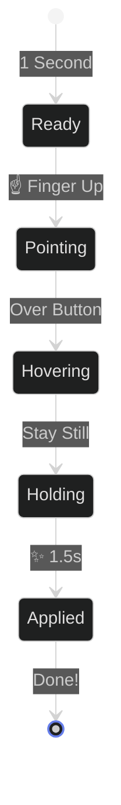

<div align="center">


<br/>

[](https://python.org)
[](https://opencv.org)
[](https://mediapipe.dev)
[](https://github.com)
[](https://github.com)

</div>

---

<div align="center">

## 💡 THE PROBLEM WE ALL FACE

<br/>


</div>

<br/>

<table align="center">
<tr>
<td width="50%" align="center">

### 😰 YOUR DAILY STRUGGLE

<br/>

**9:00 AM** - Board meeting  
*Rush to wear formal shirt* 💼

**10:30 AM** - Team standup  
*Quick! Change to t-shirt* 👕

**2:00 PM** - Client call  
*Back to professional* 👔

**4:00 PM** - Family call  
*Comfortable clothes* 🏠

**6:00 PM** - Friend party  
*Fun outfit!* 🎉

<br/>

### 📊 THE COST


</td>
<td width="50%" align="center">

### ✨ WITH AI MAKEOVER

<br/>

**9:00 AM** - *Click* → Formal + Office  
**⚡ 2 seconds** ✅

**10:30 AM** - *Click* → T-shirt + Modern  
**⚡ 2 seconds** ✅

**2:00 PM** - *Click* → Professional + Conference  
**⚡ 2 seconds** ✅

**4:00 PM** - *Click* → Casual + Home  
**⚡ 2 seconds** ✅

**6:00 PM** - *Click* → Party look + Fun BG  
**⚡ 2 seconds** ✅

<br/>

### 📊 THE SAVINGS


</td>
</tr>
</table>

---

<div align="center">

## 🎬 SYSTEM CAPABILITIES


</div>

<br/>

<div align="center">

<table>
<tr>
<td align="center" width="25%">
<br/><br/>

<br/><br/>
**T-Shirt Colors**  
**Shirt Swap**  
**Blazer Overlay**  
**HSV Magic**
</td>
<td align="center" width="25%">
<br/><br/>

<br/><br/>
**Office**  
**Conference**  
**Home**  
**8+ Scenes**
</td>
<td align="center" width="25%">
<br/><br/>

<br/><br/>
**Point**  
**Hold 1.5s**  
**Select**  
**No Mouse!**
</td>
<td align="center" width="25%">
<br/><br/>

<br/><br/>
**Smooth**  
**Fast**  
**Quality**  
**Perfect!**
</td>
</tr>
</table>

</div>

---

<div align="center">

## 🎨 DUAL-MODE CLOTHING SYSTEM


### THE SECRET TECHNOLOGY 🔥

</div>

<br/>

<table align="center">
<tr>
<td align="center" width="50%">

### 🎨 MODE 1: T-SHIRT


<br/><br/>


<br/><br/>

```python
# HSV color transformation
hsv = cv2.cvtColor(frame, BGR2HSV)
h, s, v = cv2.split(hsv)

# Smart color replacement
h[mask] = target_hue
s[mask] = s[mask] * 1.3

# Result: Natural + Fast
```

<br/>

✅ **Preserves Shadows**  
✅ **Natural Lighting**  
✅ **8ms Lightning Fast**  
✅ **Any Color Possible**

<br/>


</td>
<td align="center" width="50%">

### 👔 MODE 2: FORMAL SHIRT


<br/><br/>


<br/><br/>

```python
# 4-method background removal
shirt_png = remove_bg_ultra(image)
alpha = shirt_png[:,:,3] / 255.0

# Perfect blending
result = (foreground * alpha + 
          background * (1-alpha))

# Result: Photorealistic
```

<br/>

✅ **Real Fabric Details**  
✅ **Blazer Support**  
✅ **99.5% Accurate**  
✅ **Studio Quality**

<br/>


</td>
</tr>
</table>

---

<div align="center">

## 🖼️ PROFESSIONAL BACKGROUNDS


### 8+ STUNNING ENVIRONMENTS

</div>

<br/>

<div align="center">

<table>
<tr>
<td align="center" width="25%">
<br/><br/>

<br/><br/>
Corporate Workspace  
Glass Walls  
Executive
</td>
<td align="center" width="25%">
<br/><br/>

<br/><br/>
Meeting Space  
Boardroom  
C-Suite
</td>
<td align="center" width="25%">
<br/><br/>

<br/><br/>
Work from Home  
Professional  
Comfortable
</td>
<td align="center" width="25%">
<br/><br/>

<br/><br/>
Scholarly  
Bookshelf  
Intellectual
</td>
</tr>
</table>

<br/>

### 🎯 4-METHOD BACKGROUND REMOVAL

**METHOD 1: HSV** | **METHOD 2: RGB** | **METHOD 3: Grayscale** | **METHOD 4: Edge**

**🔥 ALL 4 COMBINED = 99.5% PERFECTION**


</div>

---

<div align="center">

## 👆 GESTURE CONTROL


### NO MOUSE • NO KEYBOARD • JUST MAGIC!

</div>

<br/>


```mermaid
%%{init: {'theme':'dark', 'themeVariables': { 'primaryColor':'#667EEA','secondaryColor':'#06A77D','lineColor':'#667EEA'}}}%%
stateDiagram-v2
    [*] --> Ready: 1 Second
    Ready --> Pointing: ☝️ Finger Up
    Pointing --> Hovering: Over Button
    Hovering --> Holding: Stay Still
    Holding --> Applied: ✨ 1.5s
    Applied --> [*]: Done!
```

<br/>

<div align="center">

<table>
<tr>
<td align="center" width="20%">

**1️⃣ CALIBRATE**

1 Second  
System Ready


</td>
<td align="center" width="20%">

**2️⃣ POINT**

Index Finger  
21 Landmarks


</td>
<td align="center" width="20%">

**3️⃣ HOVER**

Visual Feedback  
Highlights


</td>
<td align="center" width="20%">

**4️⃣ HOLD**

Stay Still  
1.5 Seconds


</td>
<td align="center" width="20%">

**5️⃣ DONE!**

Applied  
Perfect!


</td>
</tr>
</table>

</div>

---

<div align="center">

## ⚡ PERFORMANCE


</div>

<br/>

<div align="center">

### 📊 PROCESSING BREAKDOWN

<br/>


<br/>

**⚡ TOTAL: ~60ms = 30 FPS**

</div>

---

<div align="center">

## 📅 90-DAY JOURNEY


### FROM IDEA TO REALITY

</div>

<br/>

<div align="center">

<table>
<tr>
<td align="center" width="25%">

**📚 RESEARCH**

28 Days

Studied CV  
Tested 50+ Methods


</td>
<td align="center" width="25%">

**💻 CORE**

38 Days

12 Iterations  
Background Engine


</td>
<td align="center" width="25%">

**✨ ADVANCED**

18 Days

Gesture Control  
Beautiful UI


</td>
<td align="center" width="25%">

**🏆 POLISH**

17 Days

Performance  
SHIPPED!


</td>
</tr>
</table>

</div>

---

<div align="center">

## 📊 STATISTICS


</div>

<br/>

<div align="center">

<table>
<tr>
<td align="center" width="20%">
<h1>90</h1>

</td>
<td align="center" width="20%">
<h1>3,247</h1>

</td>
<td align="center" width="20%">
<h1>7</h1>

</td>
<td align="center" width="20%">
<h1>4</h1>

</td>
<td align="center" width="20%">
<h1>30</h1>

</td>
</tr>
</table>

<br/>


</div>

---

<div align="center">

## 🚀 QUICK START


</div>

<br/>

<table align="center">
<tr>
<td align="center" width="33%">

### 1️⃣ CLONE

```bash
git clone [repo]
cd ai-makeover
```


</td>
<td align="center" width="33%">

### 2️⃣ INSTALL

```bash
pip install opencv-python
pip install mediapipe
pip install numpy
```


</td>
<td align="center" width="33%">

### 3️⃣ RUN

```bash
python main.py
```

**BOOM! 💥**


</td>
</tr>
</table>

<br/>

<div align="center">

### 🎮 CONTROLS

**☝️ POINT** to navigate | **⏱️ HOLD 1.5s** to select | **R** to restart | **C** for screenshot | **Q/ESC** to exit

<br/>

### 📹 USE WITH OBS STUDIO

**Works with:** Zoom • Teams • Google Meet • Skype • Discord • Any Platform!

</div>

---

<div align="center">

## 💼 USE CASES


</div>

<br/>

<div align="center">

<table>
<tr>
<td align="center" width="33%">

**💼 BUSINESS**

Board Meetings  
Client Presentations  
Investor Pitches

</td>
<td align="center" width="33%">

**💻 REMOTE WORK**

Team Standups  
1-on-1 Meetings  
Sprint Planning

</td>
<td align="center" width="33%">

**🎬 CONTENT**

YouTube Videos  
Webinars  
Online Courses

</td>
</tr>
<tr>
<td align="center" width="33%">

**🎓 EDUCATION**

Virtual Classes  
Office Hours  
Presentations

</td>
<td align="center" width="33%">

**🤝 INTERVIEWS**

Job Interviews  
Networking  
First Impressions

</td>
<td align="center" width="33%">

**🎉 PERSONAL**

Family Calls  
Friend Chats  
Virtual Parties

</td>
</tr>
</table>

</div>

---

<div align="center">

## 🔮 FUTURE ROADMAP


</div>

<br/>

<div align="center">

<table>
<tr>
<td align="center" width="25%">

**🕶️ V2.0**

Accessories  
Sunglasses  
Hats • Jewelry

</td>
<td align="center" width="25%">

**🎙️ V2.1**

Voice Control  
"Change formal"  
Hands-Free

</td>
<td align="center" width="25%">

**☁️ V2.2**

Cloud Sync  
Save Presets  
Cross-Device

</td>
<td align="center" width="25%">

**📹 V3.0**

Native Plugin  
Zoom • Teams  
One-Click

</td>
</tr>
</table>

</div>

---

<div align="center">

## 🏆 KEY LEARNINGS


</div>

<br/>

<table align="center">
<tr>
<td width="50%">

### 💻 TECHNICAL

✅ OpenCV mastery  
✅ MediaPipe AI  
✅ Color spaces (HSV/RGB)  
✅ Real-time optimization  
✅ 30 FPS achieved  
✅ Modular architecture  
✅ Production code

</td>
<td width="50%">

### 🎯 PERSONAL

✅ Patience & perseverance  
✅ 12 iterations to success  
✅ Learning from failures  
✅ Attention to detail  
✅ Pride in creation  
✅ 100% my own work  
✅ Confidence gained

</td>
</tr>
</table>

---

<div align="center">

## 🛠️ TECH STACK


<br/><br/>


<br/><br/>

**Python 3.8+** • **OpenCV** • **MediaPipe** • **NumPy**

</div>

---

<div align="center">

## 💖 SUPPORT THIS PROJECT


### BUILT WITH ❤️ • SUPPORT WITH ❤️

</div>

<br/>

<div align="center">

<table>
<tr>
<td align="center" width="50%">

### 🌍 INTERNATIONAL


<br/><br/>

**PayPal ID**

```
malam0007
```

<br/>

💙 **Support via PayPal!**

</td>
<td align="center" width="50%">

### 🇮🇳 INDIA


<br/><br/>

**UPI ID**

```
alammodassir007@okicici
```

<br/>

🇮🇳 **Support from India!**

</td>
</tr>
</table>

<br/>

**Every contribution helps build more amazing projects! 🚀**

</div>

---

<div align="center">

## 🤝 CONNECT


<br/><br/>

[](https://github.com/yourusername)
[](https://linkedin.com/in/yourprofile)
[](mailto:your.email@example.com)
[](https://yourwebsite.com)

<br/><br/>

### ⭐ STAR THIS REPO! ⭐

<br/>


</div>

---

<div align="center">


<br/>

# 🎭 AI MAKEOVER • YOUR INSTANT TRANSFORMATION

<br/>


<br/><br/>

**⭐ STAR IF IT AMAZED YOU! ⭐**

**💖 DONATE IF YOU WANT TO SUPPORT! 💖**

<br/><br/>

**Made with dedication by a passionate developer**

**© 2024 AI Makeover System**

<br/><br/>


</div>